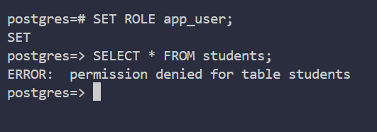

## DASHBOARD DE SISTEMA ACADEMICO 
Esta practica se trata de una pagina que funciona como reportes sobre una base de datos desarrollada con **Next.js** y **PostgreSQL**.
El propósito de esta práctica es experimentar con views e índices en PostgreSQL dentro de un entorno Docker, aplicándolos a un sistema de reportes construido con Next.js para analizar y optimizar el acceso a los datos.

### Stack Tecnológico 
* **Frontend/Framework:** Next.js 16 (App Router).
* **Base de Datos:** PostgreSQL (Dockerizado).
* **Validación de Datos:** Zod (Esquemas estrictos para URL params y tipos).
* **Visualización:** Recharts (Gráficos interactivos).
* **Estilos:** Tailwind CSS.
* **Lenguaje:** TypeScript.

## Instalacion y Despliegue 
Este proyecto está contenerizado para facilitar su despliegue.
Utiliza **Docker Compose** para orquestar tanto la aplicación (Frontend/Backend en Next.js) como la base de datos (PostgreSQL) simultáneamente.

### 1. Prerrequsisito 
* Tener instalado [Docker Desktop](https://www.docker.com/).
* Gitbash.
### 2. clona el repositorio 
```bash
git clone <TU_URL_DEL_REPO>
cd <NOMBRE_DE_TU_CARPETA>
```
### entrar al proyecto 
 Desde Git Bash buscas el directorio donde clonaste el repositorio para luego moverte dentro del proyecto
 ```bash
 cd dashboard_student
 ```
### 3. Configurar Variables de Entorno
Crea un archivo `.env` en la raíz copiando el ejemplo:
```bash
cp .env-example 
```
(Asegúrate de que las credenciales en .env coincidan con las definidas en docker-compose.yml)

### 4. levantar el contenedor
Una vez dentro del directorio que conntiene el proyecto puedes confirmar que se encuentra el archivo **docker-compose.yml**
```bash
 ls 
 ```
ejecuta el siguiente comando para levantar el contenedor 
 ```bash
 docker-compose up --build
 ```

### Mostrar Dashboard 
Una vez que la consola muestre que los servicios están listos:
Frontend/Dashboard: Abre http://localhost:3000
Base de Datos: Accesible en puerto 5432 (interno).

## Seguridad y Roles
Para garantizar la integridad de los datos y cumplir con el principio de menor privilegio, la aplicación no se conecta a la base de datos utilizando el superusuario (postgres). Se ha implementado un esquema

* **Usuario de aplicacion dedicado (app_user)**
* No puede alterar configuraciones del sistema 
* No puede crear bases de datos ni usuarios 
* No tiene permiso sobre el esquema o las tablas ya creadas

El usuario **app_user** tiene degenado el acceso directo a las tablas base (students, grades, etc) para prevenir modificicaciones accidentales o inyecciones SQL. Su acceso esta restringido exclusivamente a las Vistas SQL autorizadas

* **DENY ALL** : Protege los  datos crudos lectura/escritura no autorizada. 

* **GRANT SELECT**: Permite leer solo la información procesada necesaria para los reportes. 



## Reportes y Vistas SQL 

#### 1. Rendimiento por Curso (vw_course_performance)
* **Propósito:** Identificar asignaturas con altas tasas de reprobación para intervención temprana.

* **Metricas clave** 
* reprobados: Conteo condicional (CASE WHEN promedio < 6.0) de alumnos no aprobados.
* tasa_aprobacion: Porcentaje de éxito del grupo.
* promedio_general: Calificación media del curso.

* **Logica SQL:**  Utiliza GROUP BY y funciones de agregación (SUM, AVG, COUNT) para sintetizar el desempeño de múltiples estudiantes en una sola métrica por materia.

#### Carga Docente (vw_teacher_load)
* **Propósito:** Monitorear el balance de trabajo de los profesores y el desempeño de sus grupos.

* **Metricas clave** 
* total_grupos: Cantidad de cursos asignados (COUNT DISTINCT).
* total_estudiantes: Carga real de alumnos atendidos.
* desempeño_promedio: Promedio general de calificaciones de todos sus estudiantes.

* **Logica SQL:** Implementa HAVING para filtrar profesores inactivos (aquellos sin grupos asignados) y garantizar reportes limpios.

#### Alumnos en Riesgo (vw_students_at_risk)
* **Propósito:** Sistema de alerta temprana para retención estudiantil.

* **Metricas clave** 
* riesgo_academico: Clasificación del tipo de riesgo ('CRÍTICO', 'Académico', 'Asistencia') usando lógica condicional.

* **Logica SQL:**
Usa una CTE (Common Table Expression) llamada student_metrics para pre-calcular promedios y porcentajes de asistencia de forma limpia.
Aplica un filtro final WHERE para mostrar solo aquellos alumnos que no cumplen con la restriccion tecnica (Promedio < 6.0 o Asistencia < 70%).

#### Asistencia por Grupo (vw_attendance_by_group)
* **Propósito:** Control de cumplimiento de sesiones y asistencia promedio.

* **Metricas clave** 
* sesiones_totales: Número de clases registradas.
* asistencia_promedio: Porcentaje de asistencia global del grupo.

* **Logica SQL:** Realiza múltiples JOIN entre groups, courses, teachers y attendance para relacionar la asistencia diaria con la estructura académica.

#### Cuadro de Honor (vw_rank_students)
* **Propósito:** Reconocimiento a la excelencia académica.

* **Metricas clave** 
* ranking: Posición del alumno dentro de su generación.
* promedio_final: Calificación calculada con precisión de 2 decimales.

* **Logica SQL:** Utiliza Window Functions (RANK() OVER (PARTITION BY ... ORDER BY ...)) para generar la posición del estudiante dinámicamente, segmentado por programa académico y periodo, sin necesidad de subconsultas.


####  Fuentes  
* clientes de forma perezosa [Pool](https://node-postgres.com/apis/pool)
* Para [Roles de usuario](https://medium.com/@maraclaudiaprezescalante/postgresql-usuarios-roles-y-c%C3%B3mo-no-arruinar-tu-modelo-de-permisos-5be8099f97c0)
* Para [Indices](https://www.datacamp.com/es/tutorial/sql-server-index) de sql 
* Para  conocer de [CTE](https://www.datacamp.com/es/tutorial/cte-sql)